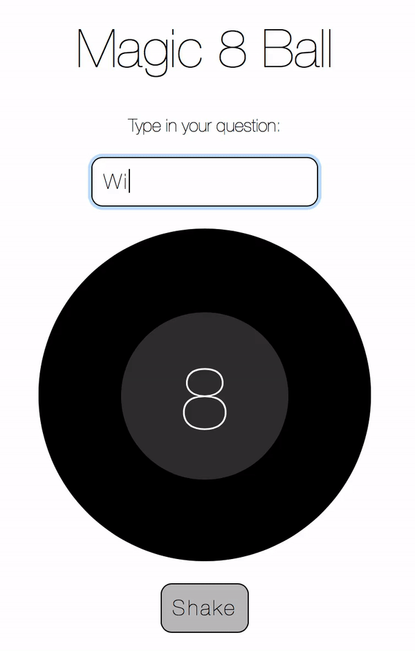

# Magic 8 Ball 
Project built following [Kelly Lougheed's tutorial](https://medium.com/@kellylougheed/javascript-magic-8-ball-with-basic-dom-manipulation-1636b83c3c26) 

Manipulate HTML elements with JavaScript:  make something happen when you click on a button; get user input from a text input box and do something with it. 

## How To Use
- Ask any "yes" or "no" question
- Click "Shake" button and you'll get the answer!

